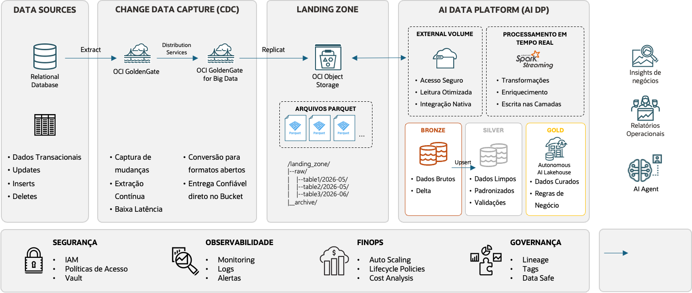

# digital-insurance-ai-data-platform
Reference implementation of an AI-ready Digital Insurance Data Platform built on Oracle Cloud Infrastructure (OCI).
# Digital Insurance AI Data Platform

Implementação de referência de uma plataforma de dados para seguros digitais na Oracle Cloud Infrastructure (OCI). O laboratório demonstra o processamento de eventos de sinistros em **near real time**, desde um Oracle Database transacional até a **OCI AI Data Platform**, usando **OCI GoldenGate** para Change Data Capture (CDC) e uma arquitetura Medallion com as camadas Bronze, Silver e Gold.

> Este projeto tem finalidade educacional. Os dados gerados são sintéticos e não representam pessoas, apólices ou sinistros reais.

## Objetivos do laboratório

- Capturar `INSERT`, `UPDATE` e `DELETE` no Oracle Database por CDC.
- Replicar as alterações, em formato Parquet, para uma landing zone no OCI Object Storage.
- Processar carga inicial e eventos incrementais com Spark Structured Streaming.
- Organizar os dados nas camadas Bronze, Silver e Gold.
- Produzir visões operacionais para triagem de sinistros, acompanhamento de filas, prevenção a fraude e detecção de catástrofes.
- Disponibilizar dados curados no Autonomous AI Lakehouse para consumo analítico e por aplicações de IA.

## Arquitetura



O fluxo implementado é:

1. **Oracle Database:** mantém os dados transacionais de clientes, apólices, veículos e sinistros.
2. **OCI GoldenGate:** o Extract captura as mudanças no banco de origem e o Replicat for Big Data entrega arquivos Parquet no OCI Object Storage.
3. **Landing zone:** armazena a carga inicial e os eventos CDC particionados por origem e tabela.
4. **Bronze:** preserva os dados recebidos e aplica as operações CDC em tabelas Delta.
5. **Silver:** limpa, padroniza e valida os campos, propagando as mudanças por Delta Change Data Feed.
6. **Gold:** aplica regras de negócio e gera tabelas prontas para análise operacional no Autonomous AI Lakehouse.

Segurança, observabilidade, FinOps e governança são capacidades transversais à arquitetura.

## Tecnologias utilizadas

- Oracle Database 26ai
- OCI GoldenGate e OCI GoldenGate for Big Data
- OCI Object Storage
- OCI AI Data Platform Workbench
- Apache Spark / Spark Structured Streaming
- Delta Lake e Delta Change Data Feed (CDF)
- Autonomous AI Lakehouse
- SQL e notebooks PySpark

## Estrutura do repositório

```text
.
├── image.png
├── README.md
└── src
    ├── source-oracle-database
    │   └── dados_sinteticos_triagemdesinistros_v1.sql
    ├── table-schema
    │   └── *.json
    ├── bronze-ingestion
    │   └── ingestion.ipynb
    ├── silver-ingestion
    │   ├── ingestion.ipynb
    │   └── queries/*.sql
    └── gold-ingestion
        ├── ingestion_painel_operacional.ipynb
        ├── ingestion_deteccao_catastrofe.ipynb
        └── queries/*.sql
```

| Diretório | Conteúdo |
|---|---|
| `src/source-oracle-database` | DDL do modelo transacional, geração da massa sintética e triggers de atualização. |
| `src/table-schema` | Esquemas JSON usados na leitura dos arquivos Parquet da landing zone. |
| `src/bronze-ingestion` | Notebook parametrizado para carga inicial e aplicação incremental de eventos CDC. |
| `src/silver-ingestion` | Notebook de ingestão Silver e consultas SQL de limpeza e padronização por tabela. |
| `src/gold-ingestion` | Notebooks e regras SQL que materializam os produtos de dados de negócio. |

## Modelo de dados de origem

O script [`dados_sinteticos_triagemdesinistros_v1.sql`](src/source-oracle-database/dados_sinteticos_triagemdesinistros_v1.sql) cria oito tabelas relacionadas ao processo de First Notice of Loss (FNOL):

| Tabela | Descrição |
|---|---|
| `TB_CLIENTE` | Dados cadastrais e de relacionamento do segurado. |
| `TB_APOLICE` | Vigência, cobertura, prêmio, status e risco da apólice. |
| `TB_VEICULO` | Dados do veículo associado às apólices de automóvel. |
| `TB_SINISTRO` | Registro operacional do sinistro; principal tabela do fluxo CDC. |
| `TB_SINISTRO_HISTORICO` | Histórico agregado de sinistros por apólice. |
| `TB_PERICIA` | Agendamento e resultado das perícias. |
| `TB_PAGAMENTO` | Pagamentos realizados para sinistros aprovados. |
| `TB_FRAUDE_SINAL` | Sinais e scores associados a suspeitas de fraude. |

A massa inicial contém aproximadamente **12 mil clientes**, **15 mil apólices** e **45 mil sinistros**, além dos respectivos veículos, históricos, perícias, pagamentos e sinais de fraude. Todas as tabelas possuem `DT_INSERCAO`; o script também cria triggers para atualizar esse timestamp quando os registros são alterados.

## Pré-requisitos

- Uma tenancy OCI e permissões para criar e acessar os serviços usados na arquitetura.
- Oracle Database 26ai acessível pelo OCI GoldenGate.
- OCI GoldenGate configurado para a origem Oracle e OCI GoldenGate for Big Data configurado para o destino.
- Bucket no OCI Object Storage para a landing zone.
- Workspace na OCI AI Data Platform com acesso ao Object Storage.
- Catálogos e schemas equivalentes aos utilizados pelos notebooks, ou seus nomes ajustados no código:
  - `lab_catalog_raw.digital_insurance`
  - `lab_catalog_bronze.digital_insurance`
  - `lab_catalog_silver.digital_insurance`
  - `lab_ailakehouse_gold.lab_digitalinsurance_aidp`

## Como executar o laboratório

### 1. Preparar o Oracle Database

Conecte-se ao schema que será utilizado como origem e execute:

```sql
@src/source-oracle-database/dados_sinteticos_triagemdesinistros_v1.sql
```

O início do arquivo contém uma rotina opcional de limpeza. Ela remove as tabelas do laboratório e deve ser usada com cuidado ao repetir a execução.

Ao final, valide a quantidade de registros retornada pela consulta de conferência incluída no próprio script.

### 2. Configurar o OCI GoldenGate

A instância e as conexões do OCI GoldenGate podem ser criadas seguindo o laboratório descrito em [Bringing external data into AI Data Platform Workbench](https://blogs.oracle.com/ai-data-platform/bringing-external-data-into-ai-data-platform-workbench).

Configure o Extract para capturar as oito tabelas do schema de origem. Cole abaixo o parameter file utilizado no ambiente:

<details>
<summary>Parâmetros do Extract</summary>

```text
-- Cole aqui o parameter file do Extract

```

</details>

Configure o Replicat for Big Data para escrever os eventos no bucket da landing zone, no formato esperado pelo notebook Bronze. Cole abaixo os parâmetros utilizados:

<details>
<summary>Parâmetros do Replicat</summary>

```text
-- Cole aqui os parâmetros do Replicat

```

</details>

No código atual, o notebook Bronze espera encontrar os arquivos em:

```text
/Volumes/lab_catalog_raw/digital_insurance/FNOL/USER_ADMIN/<NOME_DA_TABELA>/*.parquet
```

Cada evento deve incluir os metadados de controle consumidos pelo pipeline, especialmente `op_type` (`I`, `U` ou `D`) e `op_ts`. Caso o schema, o usuário de origem ou o layout da landing zone sejam diferentes, ajuste `source_folder` no notebook Bronze e os arquivos em `src/table-schema`.

### 3. Importar os artefatos no AI Data Platform Workbench

Disponibilize a pasta `src` no workspace em `/Workspace/ai-data-platform/src`, caminho usado pelos notebooks para carregar schemas e consultas SQL. Se utilizar outro local, altere os caminhos absolutos antes da execução.

Crie os catálogos, schemas, volumes externos e credenciais necessários. Não grave chaves ou senhas nos notebooks; utilize o mecanismo de credenciais do Workbench e aplique o princípio do menor privilégio.

### 4. Executar a camada Bronze

Execute [`src/bronze-ingestion/ingestion.ipynb`](src/bronze-ingestion/ingestion.ipynb) uma vez para cada tabela, informando:

| Parâmetro | Exemplo | Descrição |
|---|---|---|
| `catalog` | `lab_catalog_bronze` | Catálogo de destino. |
| `schema` | `digital_insurance` | Schema de destino. |
| `table` | `tb_sinistro` | Tabela processada. |
| `pk_field` | `id` | Chave primária na origem. |

Na primeira execução, o notebook consolida a carga completa e cria a tabela Delta. Nas seguintes, lê os novos arquivos como stream, mantém o evento mais recente de cada chave por `op_ts` e aplica `INSERT`, `UPDATE` ou `DELETE` com `MERGE`. O checkpoint impede o reprocessamento de arquivos já consumidos.

O notebook está configurado com `trigger(availableNow=True)`, adequado à execução incremental agendada. Para um processo contínuo, substitua-o por um trigger periódico, por exemplo `trigger(processingTime="1 minute")`.

### 5. Executar a camada Silver

Execute [`src/silver-ingestion/ingestion.ipynb`](src/silver-ingestion/ingestion.ipynb) para cada tabela Bronze. Informe os catálogos de origem e destino, o schema, a tabela, a chave antiga (`pk_field_old`) e a chave padronizada (`pk_field`).

As consultas em `src/silver-ingestion/queries`:

- renomeiam chaves para nomes de negócio;
- tratam valores nulos;
- padronizam textos em maiúsculas;
- normalizam tipos e campos de data;
- propagam inserções, alterações e exclusões por Delta Change Data Feed e `MERGE`.

### 6. Executar a camada Gold

Há dois padrões de processamento:

- [`ingestion_painel_operacional.ipynb`](src/gold-ingestion/ingestion_painel_operacional.ipynb) executa a consulta indicada pelo parâmetro `table_name` e atualiza um snapshot no Autonomous AI Lakehouse a cada dez minutos.
- [`ingestion_deteccao_catastrofe.ipynb`](src/gold-ingestion/ingestion_deteccao_catastrofe.ipynb) usa streaming com estado, watermark e janelas deslizantes para gerar alertas de catástrofe.

Para o painel operacional, execute o notebook para cada SQL desejado em `src/gold-ingestion/queries`, usando o nome do arquivo sem a extensão como `table_name`.

## Produtos de dados da camada Gold

| Produto de dados | Caso de negócio e resultado | Técnica utilizada |
|---|---|---|
| `tb_fnol_triagem_atual` | Prioriza cada sinistro e recomenda a rota operacional: revisão de cobertura, revisão de fraude, análise humana ou fast-track. | Junção de sinistro, apólice e fraude; validação de vigência; cálculo do índice de dano; score ponderado e regras determinísticas de classificação. |
| `tb_op_fila_de_sinistros` | Oferece uma fila viva de sinistros abertos ou em análise, mostrando volume, valor exposto, tempo de espera, risco de SLA e pressão de novas entradas. | Agregação por tipo, status e faixa de espera; métricas temporais; contagem de eventos CDC dos últimos 15 minutos; snapshot atualizado periodicamente. |
| `tb_op_alerta_sinal_fraude_nrt` | Destaca sinais de fraude recentes e eleva a severidade quando o pagamento já foi emitido, permitindo intervenção rápida. | Janela móvel de 30 minutos; agregação dos sinais por sinistro; limiar de score; enriquecimento com cliente, apólice e pagamento; classificação por regras. |
| `tb_op_deteccao_catastrofe` | Detecta concentrações recentes de sinistros semelhantes em uma região, estima a exposição e classifica o evento para mobilização de reservas, peritos e comunicação. | Clusterização espacial por geo-grid de aproximadamente 0,25° e janela de 30 minutos; agregações geográficas e financeiras; limiares de volume. |
| `tb_catastrofe_alerta` / `vw_tb_catastrofe_alerta_atual` | Mantém alertas ativos de possíveis catástrofes em fluxo, com quantidade de sinistros, exposição, centroide e severidade por janela. | Spark Structured Streaming stateful; janela deslizante de 1 hora a cada 15 minutos; watermark de 2 horas; limiares de quantidade e valor; visão com a versão mais recente do alerta. |

Os limiares e pesos são didáticos e devem ser calibrados com dados históricos, apetite a risco, SLAs e políticas da seguradora antes de qualquer uso produtivo.

## Validação do fluxo

Depois da carga inicial, crie, altere e remova registros no Oracle Database e confirme:

1. a chegada de novos arquivos Parquet à landing zone;
2. a aplicação correta de `I`, `U` e `D` na Bronze;
3. a propagação das mudanças e padronizações na Silver;
4. a atualização das tabelas Gold dentro do intervalo configurado;
5. a ausência de erros nos checkpoints e logs dos streams.

Para testar cenários near real time, concentre eventos de fraude ou sinistros geograficamente próximos dentro das janelas definidas nas consultas Gold.

## Considerações para produção

- Substitua dados sintéticos e limiares fixos por regras governadas e calibradas.
- Proteja dados pessoais, como CPF e nome, com mascaramento, criptografia e controles de acesso.
- Monitore atraso do Extract/Replicat, freshness das tabelas, falhas de micro-batch e crescimento dos checkpoints.
- Defina políticas de retenção e lifecycle para landing zone, tabelas Delta e checkpoints.
- Implemente testes de qualidade, reconciliação de contagens e tratamento de schema evolution.
- Versione a configuração do GoldenGate sem incluir credenciais ou outros segredos.

## Referências

- [Bringing external data into AI Data Platform Workbench](https://blogs.oracle.com/ai-data-platform/bringing-external-data-into-ai-data-platform-workbench)
- [OCI GoldenGate](https://docs.oracle.com/en/cloud/paas/goldengate-service/)
- [Oracle AI Data Platform](https://www.oracle.com/data-platform/)

## Licença

Este projeto está disponibilizado sob os termos descritos no arquivo [LICENSE](LICENSE).